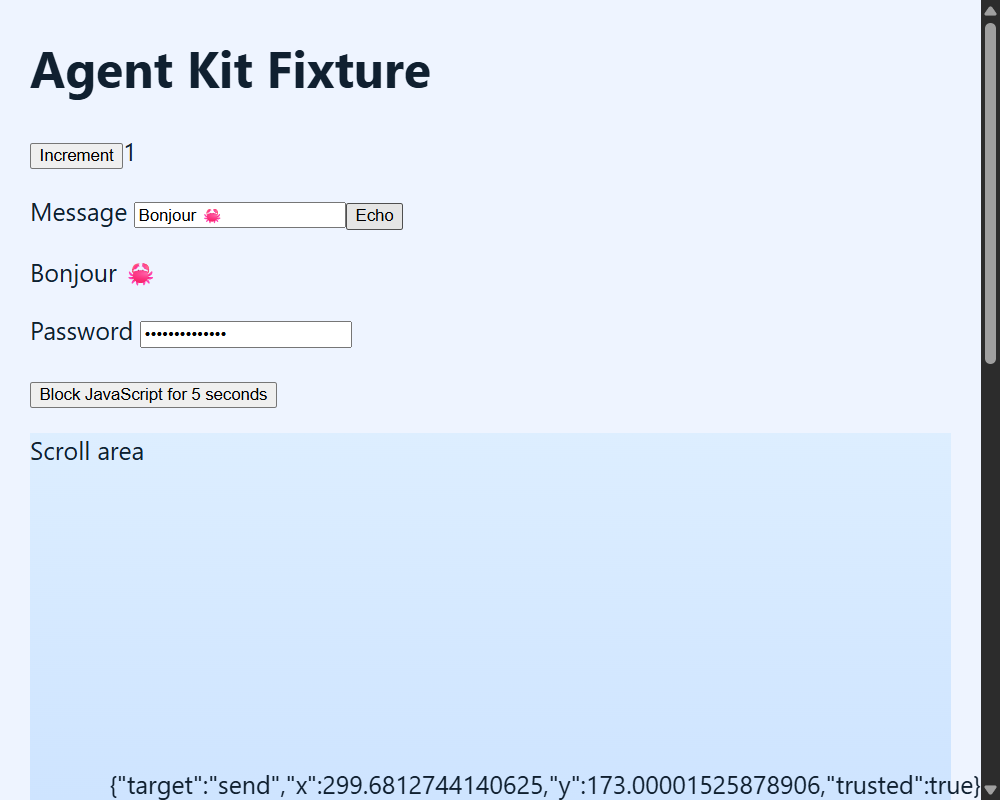

# Recorded fixture demonstration

Only the bundled generic fixture is used. The screenshot is a native WebView2 CapturePreview, not a DOM reconstruction or generated marketing image.

Reproduce with `cargo build -p agent-kit-fixture --locked`, then `node scripts/live-test.mjs --require-native` on a reserved Windows desktop. The script discovers its own process, addresses the main WebView by label, observes a click, inserts Unicode, calls Rust through the Echo button, checks instrumentation, restores zoom, captures pixels, scrolls and verifies native input effects. It stops its own fixture in `finally`.

The recorded [outcomes](media/fixture-results.json) are a local run, not a promise that native focus will succeed on every desktop. The screenshot is captured before the native-input phase. No external application screenshots or raw session logs are included.
